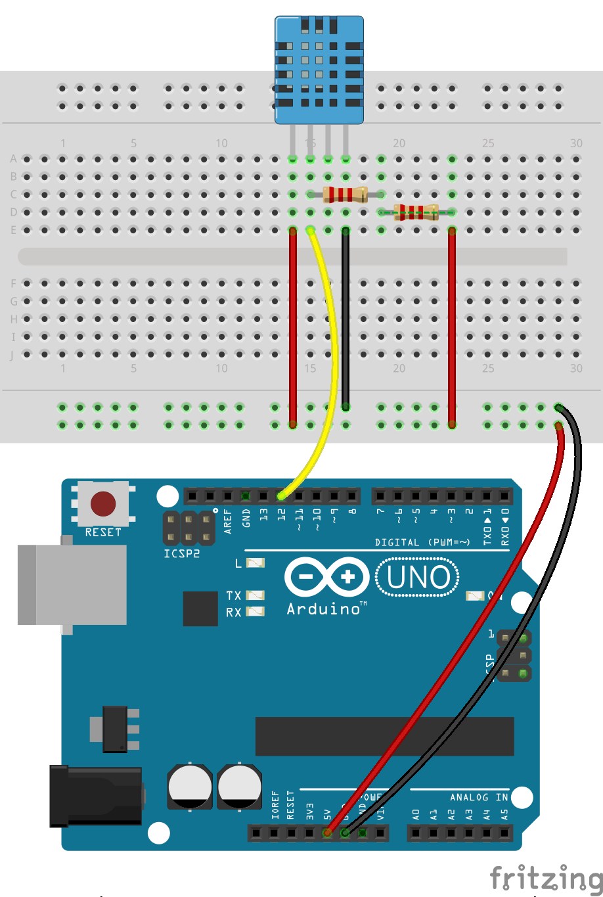
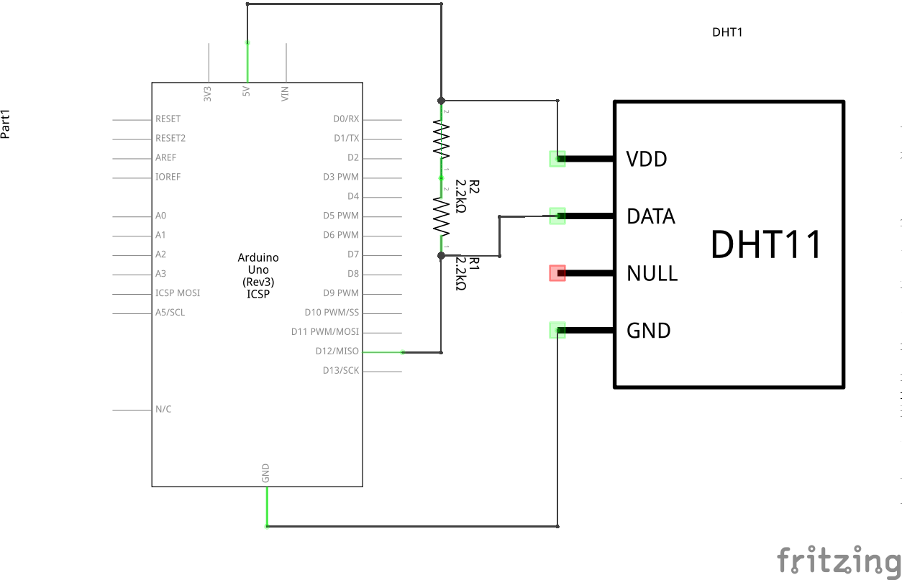

# project2

## Collin Reilly Clark
## 605.715

### Requirements

I am following the project requirements to sample the temperature at a period
of 10 seconds and output the results, along with the time, on the serial
console.

I have a counter that is contained within a mutex, which can only be unlocked
inside an interrupt-free section. Once the counter passes a certain value,
the main loop reads the sensor and outputs the data to the serial console.

Additionally, I toggle the on-board LED during every read to provide a visual
indicator that the timer is working at the correct interval.

### Diagram

\
\
\

### Code

```rust

#![no_std]
#![no_main]
#![feature(abi_avr_interrupt)]

// heavily influenced by the safe interrupts described by this blogpost:
// https://blog.rahix.de/005-avr-hal-millis/
// https://github.com/Rahix/avr-hal/blob/master/boards/arduino-uno/examples/uno-millis.rs

extern crate panic_halt;
use arduino_uno::prelude::*;
use dht_sensor::*;
use core::cell;

// set timer frequency -- 1024 + 250 = 16ms
//                               10s / 16ms = 625 interrupts / sample
const PRESCALER: u32 = 1024;
const TIMER_COUNTS: u32 = 250;
const INTERRUPT_FREQ_MILLIS: u32 = PRESCALER * TIMER_COUNTS / 16_000; // 16MHz
const SAMPLE_RATE_MILLIS: u32 = 10_000; // 10 s
const COUNTER_MAX: u32 = SAMPLE_RATE_MILLIS / INTERRUPT_FREQ_MILLIS;

static COUNTER: avr_device::interrupt::Mutex<cell::Cell<u32>> =
    avr_device::interrupt::Mutex::new(cell::Cell::new(0));

fn timer_init(tc0: arduino_uno::pac::TC0) {
    // config timer for interval and enable interrupt
    tc0.tccr0a.write(|w| w.wgm0().ctc());
    tc0.ocr0a.write(|w| unsafe { w.bits(TIMER_COUNTS as u8) });
    tc0.tccr0b.write(|w| match PRESCALER {
        8 => w.cs0().prescale_8(),
        64 => w.cs0().prescale_64(),
        256 => w.cs0().prescale_256(),
        1024 => w.cs0().prescale_1024(),
        _ => panic!(),
    });
    tc0.timsk0.write(|w| w.ocie0a().set_bit());

}

#[avr_device::interrupt(atmega328p)]
fn TIMER0_COMPA() {
    avr_device::interrupt::free(|cs| {
        let counter = COUNTER.borrow(cs).get();
        COUNTER.borrow(cs).set(counter + 1);
    });
}

#[arduino_uno::entry]
fn main() -> ! {
    let peripherals = arduino_uno::Peripherals::take().unwrap();

    let mut pins = arduino_uno::Pins::new(peripherals.PORTB, peripherals.PORTC, peripherals.PORTD);

    timer_init(peripherals.TC0);

    let mut led = pins.d13.into_output(&mut pins.ddr);
    let mut sensor = pins.d12.into_tri_state(&mut pins.ddr);
    let mut seconds = 0;
    let mut serial = arduino_uno::Serial::new(
        peripherals.USART0,
        pins.d0,
        pins.d1.into_output(&mut pins.ddr),
        57600.into_baudrate(),
    );
    let mut delay = arduino_uno::Delay::new();
    ufmt::uwriteln!(&mut serial, "Seconds, Temperature C, Humidity\r").void_unwrap();

    unsafe { avr_device::interrupt::enable() };

    loop {
        arduino_uno::delay_ms(100); // wait 0.1 s

        avr_device::interrupt::free(|cs| {
            // check to see if timer has gone off
            let counter = COUNTER.borrow(cs);
            if counter.get() >= COUNTER_MAX {
                counter.set(0);
                seconds += 10;
                led.toggle().void_unwrap();
                match dht11::Reading::read(&mut delay, &mut sensor) {
                    Ok(result) =>
                        ufmt::uwriteln!(&mut serial,
                            "{}, {}.{}, {}.{}\r",
                            seconds,
                            result.temperature,
                            result.temperature_decimal,
                            result.relative_humidity,
                            result.relative_humidity_decimal).void_unwrap(),
                    Err(_) =>
                        ufmt::uwriteln!(&mut serial,
                            "sensor error -- skipping to next read\r").void_unwrap(),
                };
            };
        });
    }
}
```

### Video

[https://youtu.be/HEmbwAK0wa4](https://youtu.be/HEmbwAK0wa4)
